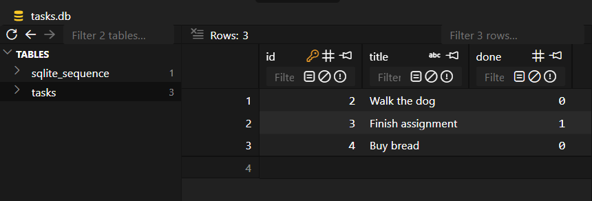
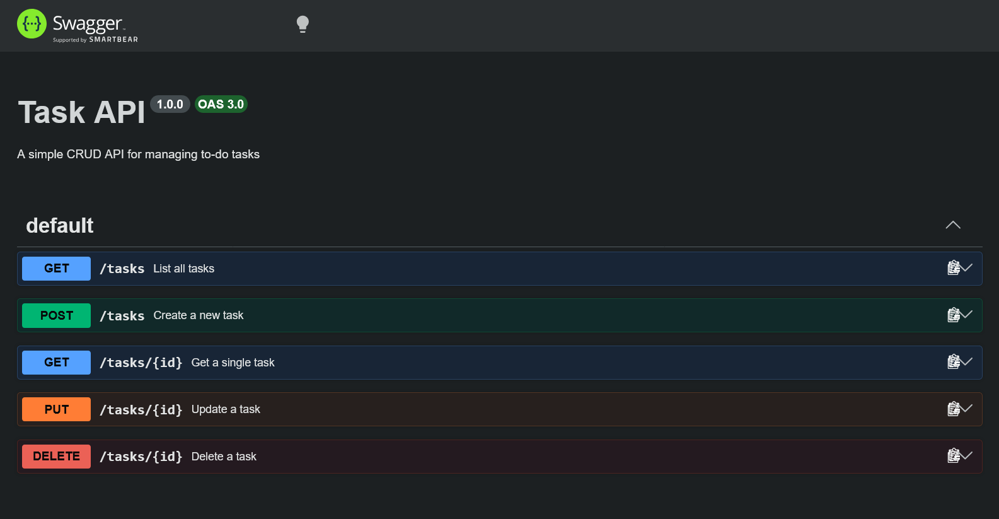

# CRUD TASK API

A simple CRUD API for managing to-do tasks, built with TypeScript, Express, and Node.js. Data is stored in a SQLite database and survives server restarts.

## Run it

```bash
npm install
npm run dev
```

Server runs at `http://localhost:6767`. The database file (`tasks.db`) and its table are created automatically on first run, seeded with 3 example tasks.

## Why SQLite

SQLite needs no separate server or install — it's a single file (`tasks.db`) that's created automatically the first time the app runs. That's enough for this project: data now survives a restart, with zero setup cost. `tasks.db` is git-ignored, so every clone starts fresh with the seeded data.

## Endpoints

| Method | Path         | Description                        |
|--------|--------------|-------------------------------------|
| GET    | /            | API info                            |
| GET    | /health      | Health check                        |
| GET    | /tasks       | List all tasks                      |
| GET    | /tasks/:id   | Get a single task                   |
| POST   | /tasks       | Create a task                       |
| PUT    | /tasks/:id   | Update a task's title and/or done   |
| DELETE | /tasks/:id   | Delete a task                       |
| POST   | /tasks/reset | Reset to the 3 seed tasks           |

## API docs

Interactive Swagger UI: `http://localhost:6767/docs`

## Example

```bash
curl -i -X POST http://localhost:6767/tasks -H "Content-Type: application/json" -d '{"title":"Buy milk"}'
```

```
HTTP/1.1 201 Created
Content-Type: application/json; charset=utf-8

{"id":4,"title":"Buy milk","done":false}
```

## Exploring the database directly

Opened `tasks.db` via the `sqlite3` CLI and ran:

```sql
SELECT * FROM tasks WHERE done = 1;
```

Returned one row: `3|Finish assignment|1` - the only task marked done at the time.



## Swagger UI

